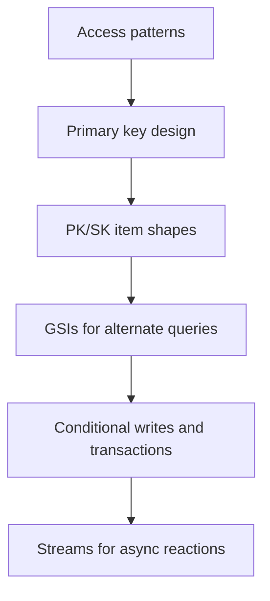

## DynamoDB types and minute design details

DynamoDB design starts with access patterns, not normalized entities.

Core types:

| Concept | Meaning |
|---|---|
| Table | collection of items |
| Item | one record, max item size applies |
| Attribute | field inside an item |
| Partition key | hash key used to distribute and locate items |
| Sort key | range key used to order/query items within a partition |
| GSI | separate query structure with its own partition/sort key |
| LSI | alternate sort key with same partition key; created with table |
| Stream | ordered change log of item mutations |
| TTL | expiration timestamp for automatic deletion |

## Single-table modeling mental model



Example table:

```text
PK                  SK                    entityType
USER#42             PROFILE               User
USER#42             ORDER#2026-001        Order
ORDER#2026-001      ITEM#1                OrderItem
ORG#9               USER#42               OrgMember
```

This is intentionally denormalized for query speed.

## Python boto3 conditional write

```python
import boto3
from botocore.exceptions import ClientError


db = boto3.resource("dynamodb")
table = db.Table("LargeFileJobs")


def start_job(job_id: str, bucket: str, key: str) -> bool:
    try:
        table.put_item(
            Item={
                "pk": f"JOB#{job_id}",
                "sk": "META",
                "status": "STARTED",
                "bucket": bucket,
                "key": key,
            },
            ConditionExpression="attribute_not_exists(pk)",
        )
        return True
    except ClientError as exc:
        if exc.response["Error"]["Code"] == "ConditionalCheckFailedException":
            return False
        raise
```

Conditional writes are the heart of idempotency in event-driven systems.
