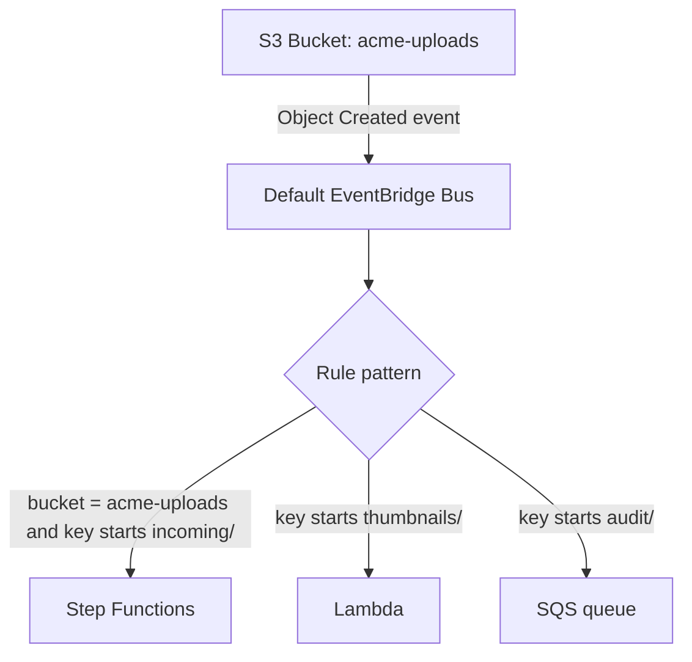

## Detailed S3 EventBridge event pattern

S3 does not create a normal “connection object” to EventBridge. The bucket is configured to deliver events to EventBridge, and EventBridge rules decide what to do with those events.



Example EventBridge rule pattern:

```json
{
  "source": ["aws.s3"],
  "detail-type": ["Object Created"],
  "detail": {
    "bucket": {
      "name": ["acme-claims-prod-uploads"]
    },
    "object": {
      "key": [{ "prefix": "incoming/" }]
    }
  }
}
```

## S3 native notification vs EventBridge

| Feature | S3 native event notification | S3 with EventBridge |
|---|---|---|
| Configuration location | S3 bucket notification config | Enable EventBridge on bucket + EventBridge rules |
| Filtering | prefix/suffix filters | richer JSON event pattern filtering |
| Targets | Lambda, SNS, SQS | Lambda, Step Functions, SQS, SNS, ECS, Batch, API destinations, event bus targets |
| Fan-out | limited | multiple independent rules |
| Workflow orchestration | weaker | strong when routed to Step Functions |
| Production routing | okay for simple trigger | better for complex event-driven systems |

## Console setup checklist

1. Open **S3 → Bucket → Properties**.
2. Find **Event notifications**.
3. Under **Amazon EventBridge**, choose **Edit**.
4. Turn EventBridge delivery **On**.
5. Open **Amazon EventBridge → Rules → Create rule**.
6. Choose event source: **AWS services**.
7. Choose service: **S3**.
8. Choose event type like **Object Created**.
9. Add an event pattern for bucket and key prefix.
10. Select target: Lambda, Step Functions, SQS, SNS, ECS, or another supported target.
11. Configure retry policy and DLQ where supported.
12. Test by uploading an object to the matching prefix.

## Lambda handler for S3 EventBridge event

```python
import json
import boto3
from urllib.parse import unquote_plus

s3 = boto3.client("s3")


def lambda_handler(event, context):
    detail = event["detail"]
    bucket = detail["bucket"]["name"]
    key = unquote_plus(detail["object"]["key"])
    version_id = detail["object"].get("version-id")

    print(json.dumps({"bucket": bucket, "key": key, "versionId": version_id}))

    obj = s3.get_object(Bucket=bucket, Key=key)
    # Process stream; avoid loading huge files fully into memory.
    body = obj["Body"].read(1024)

    return {
        "statusCode": 200,
        "body": json.dumps({"processed": key})
    }
```

## Idempotency design

S3/EventBridge systems should assume that duplicate or repeated processing can happen. A robust processor stores processing state.

```text
DynamoDB table: FileProcessingJobs
PK: bucket#key#versionId
status: STARTED | COMPLETED | FAILED
startedAt
completedAt
executionArn
outputKey
error
```

Before processing, the worker conditionally creates a STARTED record. If the record already exists as COMPLETED, the worker exits safely.

## Production traps

- Uploading to the same prefix where the processor writes output can create recursive events.
- Forgetting `urllib.parse.unquote_plus` can break keys with spaces or encoded characters.
- Treating EventBridge delivery as exactly-once is unsafe; design idempotently.
- Not adding DLQs/retries makes failures hard to diagnose.
- Not scoping rule pattern tightly can trigger expensive workflows for irrelevant files.
- For SSE-KMS buckets, the target role may need `kms:Decrypt`.
