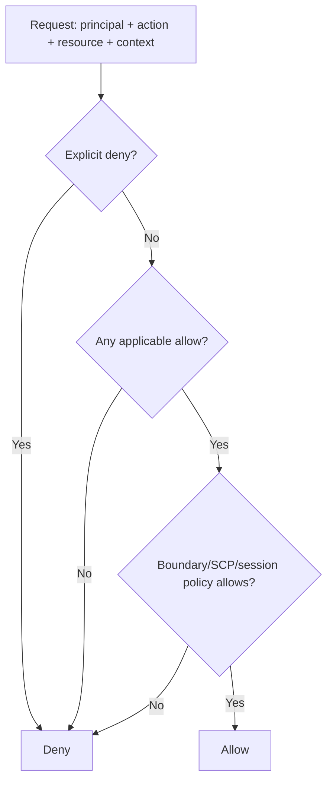

## IAM evaluation order in practical terms

When AWS receives a request, IAM checks all applicable policies and conditions. A simplified mental model:

The most important rule: **explicit deny wins**.

## IAM vs resource policy vs security group

| Concept | Controls | Example |
|---|---|---|
| IAM identity policy | AWS API permissions for a principal | Lambda role can call `s3:GetObject` |
| Resource policy | Who can access a resource | S3 bucket policy allows a role to read a prefix |
| KMS key policy | Who can use/decrypt with a key | Lambda role can decrypt SSE-KMS object |
| Security group | Network traffic | Lambda ENI can connect to RDS on port 5432 |
| NACL | subnet-level stateless network filtering | rarely first-level app control |

A Lambda connecting to RDS needs both:

1. IAM permission to read DB secrets from Secrets Manager.
2. Network permission through VPC/subnet/security group to reach RDS port 5432/3306.

## Clean production role examples

- `claims-prod-api-lambda-role`
- `claims-prod-stepfunctions-role`
- `claims-prod-ecs-task-role`
- `claims-prod-ecs-task-execution-role`
- `claims-prod-glue-job-role`
- `claims-prod-github-deploy-role`

Minute distinction: **ECS task execution role** lets ECS pull images and write logs; **ECS task role** is what the application code inside the container uses to call AWS APIs.
