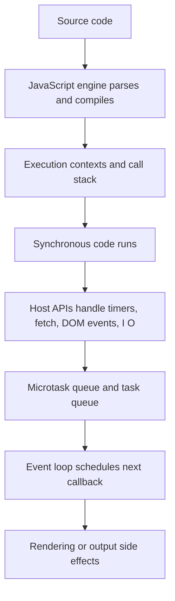
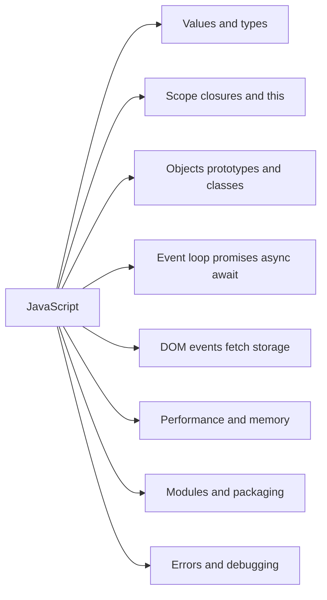
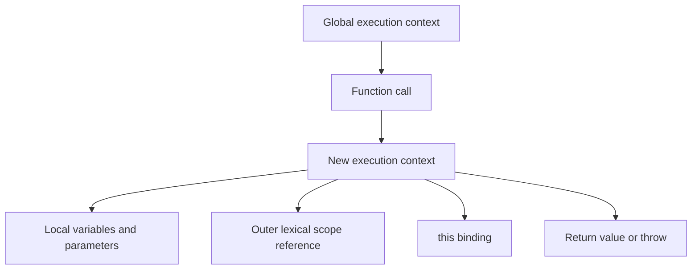
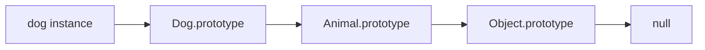
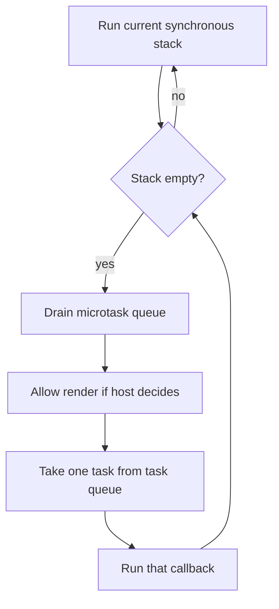
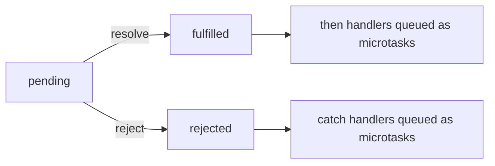
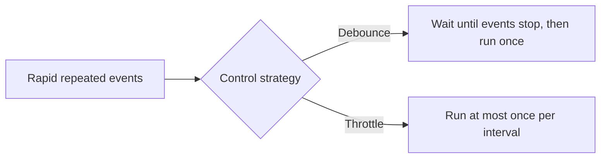
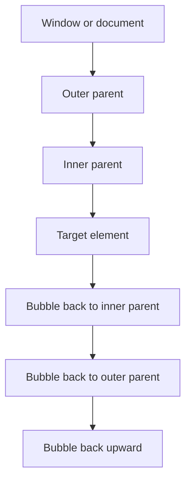
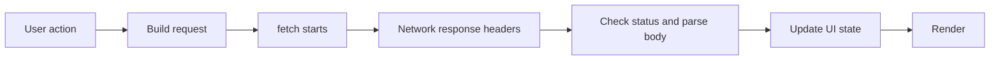

# JavaScript

## JavaScript mental model

JavaScript is a language, but in real applications you never use the language alone. You use:

- the **language** itself: variables, functions, objects, classes, modules, promises;
- the **engine**: V8, SpiderMonkey, JavaScriptCore;
- the **host environment**: browser or Node.js;
- the **platform APIs** the host provides: DOM, timers, `fetch`, storage, streams, workers, file system, process APIs.

That is why a good JavaScript answer separates **language behavior** from **host behavior**.



## Topic map



## What JavaScript is

JavaScript is:

- dynamically typed;
- garbage collected;
- prototype based;
- multi-paradigm: imperative, object-oriented, functional;
- single-threaded at the level of one main execution agent;
- asynchronous through event loops and host APIs.

Important correction to a common simplification:

> JavaScript is not "asynchronous by itself". JavaScript runs synchronously on the call stack. Asynchronous behavior comes from host APIs plus queues plus the event loop.

## Browser vs Node.js

| Area | Browser JavaScript | Node.js JavaScript |
|---|---|---|
| Main purpose | UI, DOM, network requests, events | servers, CLIs, scripts, tooling |
| Host APIs | DOM, `window`, `document`, `localStorage`, `fetch`, timers | `process`, file system, streams, HTTP servers, timers |
| Rendering | yes | no browser rendering |
| Module default | ESM in modern code | ESM or CommonJS depending on setup |
| Event loop host | browser | libuv-based Node event loop |
| Typical concern | UI responsiveness | throughput, I O, memory, process lifecycle |

The ECMAScript language is shared, but the host APIs are different.

## Values, types, and the memory model

### Primitive values

JavaScript primitives are:

- `string`
- `number`
- `bigint`
- `boolean`
- `undefined`
- `symbol`
- `null`

Everything else is an object or behaves like an object.

```js
const name = "Ada";
const age = 32;
const active = true;
const id = Symbol("id");
const large = 9007199254740993n;
const missing = undefined;
const empty = null;
```

### Reference values

Objects, arrays, functions, maps, sets, dates, regexes, and class instances are reference values.

```js
const user = { name: "Ada" };
const tags = ["js", "react"];
const run = () => "ok";
```

### JavaScript is pass-by-value

This is a point many people explain incorrectly.

JavaScript is **always pass-by-value**. When you pass an object, the value being copied is a **reference value**.

```js
function rename(person) {
  person.name = "Grace";   // mutates the same object
}

function replace(person) {
  person = { name: "Linus" }; // only rebinds local parameter
}

const user = { name: "Ada" };

rename(user);
console.log(user.name); // Grace

replace(user);
console.log(user.name); // Grace
```

Why:

- `rename` changes the object that both variables point to;
- `replace` only changes the local parameter variable.

### `typeof` and common quirks

```js
typeof 123;           // "number"
typeof "hello";       // "string"
typeof true;          // "boolean"
typeof undefined;     // "undefined"
typeof Symbol("x");   // "symbol"
typeof 1n;            // "bigint"
typeof {};            // "object"
typeof [];            // "object"
typeof null;          // "object"  historical bug
typeof function() {}; // "function"
```

`typeof null === "object"` is a legacy bug, not proof that `null` is a useful object.

## Variables: `var`, `let`, and `const`

| Keyword | Scope | Reassign | Hoisted | Initialized before line runs? | Practical guidance |
|---|---|---:|---|---|---|
| `var` | function | yes | yes | yes, as `undefined` | avoid in modern code |
| `let` | block | yes | yes | no, TDZ applies | use when value changes |
| `const` | block | no rebinding | yes | no, TDZ applies | default choice |

### Temporal Dead Zone

`let` and `const` exist from the start of the scope, but they cannot be used until the declaration line runs.

```js
{
  // console.log(count); // ReferenceError
  let count = 1;
}
```

### `const` does not make objects immutable

```js
const user = { name: "Ada" };
user.name = "Grace"; // allowed

// user = {}         // TypeError, rebinding not allowed
```

`const` only prevents rebinding of the variable name.

### `var` loop bug

```js
for (var i = 0; i < 3; i += 1) {
  setTimeout(() => console.log("var", i), 0);
}

for (let j = 0; j < 3; j += 1) {
  setTimeout(() => console.log("let", j), 0);
}
```

Output:

```text
var 3
var 3
var 3
let 0
let 1
let 2
```

Why:

- `var` has one shared function-scoped binding;
- `let` creates a new block-scoped binding per iteration.

## Execution context, scope chain, and hoisting

Every function call creates an execution context. It contains:

- parameter bindings;
- local variable bindings;
- a link to its outer lexical scope;
- `this` binding;
- the instruction pointer for the currently running code.



### Hoisting

Hoisting does not mean "the code moves upward". It means the engine creates bindings before the execution phase starts.

```js
sayHello(); // works

function sayHello() {
  console.log("hello");
}
```

Function declarations are available before their line appears.

```js
console.log(a); // undefined
var a = 10;

// console.log(b); // ReferenceError
let b = 20;
```

`var` is hoisted and initialized to `undefined`. `let` exists but stays in the temporal dead zone until initialization.

## Scope and lexical environment

JavaScript uses **lexical scope**. A function can access:

- its own local variables;
- variables from outer scopes where it was created;
- global variables.

It cannot directly access sibling scope variables.

```js
const appName = "Notes";

function outer() {
  const version = "1.0";

  function inner() {
    console.log(appName, version);
  }

  inner();
}

outer();
```

The important phrase is:

> Scope is decided by where a function is defined, not where it is called.

## Closures

A closure is a function plus the lexical environment it remembers from when it was created.

### Basic closure example

```js
function createCounter() {
  let count = 0;

  return function increment() {
    count += 1;
    return count;
  };
}

const counter = createCounter();
console.log(counter()); // 1
console.log(counter()); // 2
```

Why it works:

- `createCounter` has finished running;
- its local variable `count` would normally be gone;
- but the returned function still references `count`, so that environment stays alive.

### Real uses of closures

- private state;
- function factories;
- callbacks and event handlers;
- debounce and throttle implementations;
- memoization;
- React hooks and render snapshots.

### Closure pitfall: stale captured values

```js
function createGreeter(name) {
  return () => `Hello ${name}`;
}

const greetAda = createGreeter("Ada");
console.log(greetAda()); // Hello Ada
```

The closure remembers the value from creation time.

In React, stale closure bugs happen when async work keeps using old state or props from an earlier render.

## `this`

`this` is not determined by where a function is written. It is usually determined by **how the function is called**.

| Call form | `this` value |
|---|---|
| plain function call in strict mode | `undefined` |
| method call `obj.fn()` | `obj` |
| `call` / `apply` / `bind` | explicitly set |
| constructor call with `new` | the new instance |
| arrow function | no own `this`; captures outer `this` |

### Method call vs detached function

```js
"use strict";

const user = {
  name: "Ada",
  speak() {
    console.log(this.name);
  }
};

user.speak(); // Ada

const fn = user.speak;
fn(); // TypeError or undefined access depending on code path
```

### `call`, `apply`, `bind`

```js
function greet(prefix, suffix) {
  return `${prefix} ${this.name} ${suffix}`;
}

const user = { name: "Ada" };

greet.call(user, "Hello", "!");
greet.apply(user, ["Hello", "!"]);

const bound = greet.bind(user, "Hello");
bound("!"); // Hello Ada !
```

- `call` invokes immediately with positional arguments;
- `apply` invokes immediately with an argument array;
- `bind` returns a new function.

### Arrow functions

Arrow functions do not create their own `this`.

```js
const user = {
  name: "Ada",
  regular() {
    setTimeout(function () {
      console.log("regular inner", this);
    }, 0);
  },
  fixed() {
    setTimeout(() => {
      console.log("arrow inner", this.name);
    }, 0);
  }
};

user.fixed(); // arrow inner Ada
```

The arrow function closes over `this` from `fixed`.

## Functions as first-class values

In JavaScript, functions can be:

- stored in variables;
- passed as arguments;
- returned from other functions;
- assigned to object properties;
- created at runtime.

```js
function repeat(n, fn) {
  for (let i = 0; i < n; i += 1) {
    fn(i);
  }
}

repeat(3, (i) => console.log(i));
```

That is why callback-heavy APIs and higher-order functions are so common in JavaScript.

### Pure vs impure functions

A pure function:

- depends only on inputs;
- has no side effects;
- returns the same output for the same input.

```js
function add(a, b) {
  return a + b;
}
```

An impure function may:

- modify outside state;
- write to the DOM;
- do network I O;
- log;
- read time or randomness.

```js
function saveUser(user) {
  localStorage.setItem("user", JSON.stringify(user));
}
```

Pure functions are easier to test and reason about.

## Objects, prototypes, and classes

JavaScript uses **prototype delegation**, not classical inheritance under the hood.

### Prototype chain mental model



When you access `dog.speak`, JavaScript:

1. checks the object itself;
2. checks its prototype;
3. continues up the chain;
4. stops at `null`.

### Manual prototype example

```js
const animal = {
  speak() {
    return `${this.name} makes a sound`;
  }
};

const dog = Object.create(animal);
dog.name = "Bruno";

console.log(dog.speak());
```

### What `new` does

When you call `new User("Ada")`, JavaScript roughly:

1. creates a new empty object;
2. sets its internal prototype to `User.prototype`;
3. calls `User` with `this` bound to that object;
4. returns the object unless the constructor returns another object explicitly.

### Constructor function example

```js
function User(name) {
  this.name = name;
}

User.prototype.sayHi = function () {
  return `Hi ${this.name}`;
};

const user = new User("Ada");
console.log(user.sayHi());
```

### `class` syntax

`class` is cleaner syntax over prototype-based behavior.

```js
class Animal {
  constructor(name) {
    this.name = name;
  }

  speak() {
    return `${this.name} makes a sound`;
  }
}

class Dog extends Animal {
  speak() {
    return `${this.name} barks`;
  }
}

const dog = new Dog("Bruno");
console.log(dog.speak());
```

### Instance fields vs prototype methods

If you put a method on each instance, every instance gets its own copy.

```js
class BadExample {
  constructor() {
    this.run = function () {
      return "running";
    };
  }
}
```

Prototype methods are shared:

```js
class BetterExample {
  run() {
    return "running";
  }
}
```

## Equality, coercion, and truthy/falsy

### `===` vs `==`

Use `===` by default.

```js
0 === false; // false
0 == false;  // true
"" == false; // true
null == undefined; // true
```

`==` performs coercion. That makes it compact in a few rare cases, but harder to reason about in general code.

### `Object.is`

`Object.is` differs from `===` for a few edge cases.

```js
NaN === NaN;          // false
Object.is(NaN, NaN);  // true

0 === -0;             // true
Object.is(0, -0);     // false
```

### Falsy values

The falsy values are exactly:

- `false`
- `0`
- `-0`
- `0n`
- `""`
- `null`
- `undefined`
- `NaN`

Everything else is truthy, including:

- `[]`
- `{}`
- `"0"`
- `"false"`

### Nullish vs falsy

Use `??` when you only want a fallback for `null` or `undefined`.

```js
const page = inputPage ?? 1;
const title = inputTitle || "Untitled";
```

Difference:

- `||` falls back on any falsy value;
- `??` falls back only on nullish values.

## Arrays and immutable updates

JavaScript arrays are objects with ordered numeric keys and array methods.

### Common array methods

```js
const users = [
  { id: 1, name: "Ada", active: true },
  { id: 2, name: "Grace", active: false }
];

const activeUsers = users.filter((user) => user.active);
const names = users.map((user) => user.name);
const firstInactive = users.find((user) => !user.active);
const total = [10, 20, 30].reduce((sum, n) => sum + n, 0);
```

### Mutating vs non-mutating methods

| Mutates original array | Safer immutable alternative |
|---|---|
| `push` | `[...arr, item]` |
| `pop` | `arr.slice(0, -1)` |
| `splice` | `filter`, `slice`, spread |
| `sort` | `[...arr].sort(...)` |
| `reverse` | `[...arr].reverse()` |

### Shallow copy warning

Spread copies only one level.

```js
const state = {
  user: {
    name: "Ada",
    address: { city: "Delhi" }
  }
};

const next = { ...state };
next.user.address.city = "Mumbai";

console.log(state.user.address.city); // Mumbai
```

For nested updates, copy each level you change:

```js
const nextState = {
  ...state,
  user: {
    ...state.user,
    address: {
      ...state.user.address,
      city: "Mumbai"
    }
  }
};
```

## Modern syntax used constantly

### Destructuring

```js
const user = { id: 1, name: "Ada", role: "admin" };
const { name, role } = user;

const [first, second] = ["a", "b"];
```

### Rest and spread

```js
function sum(...nums) {
  return nums.reduce((total, n) => total + n, 0);
}

const base = { id: 1, name: "Ada" };
const withRole = { ...base, role: "admin" };
```

### Optional chaining

```js
const city = user?.profile?.address?.city;
```

### Nullish coalescing

```js
const pageSize = settings.pageSize ?? 20;
```

### Default parameters

```js
function createUser(name, role = "viewer") {
  return { name, role };
}
```

## Event loop in depth

This is one of the most important JavaScript topics.

### Core pieces

- **call stack**: where synchronous JavaScript runs;
- **host APIs**: timers, network, DOM events, file I O;
- **microtask queue**: promise reactions, `queueMicrotask`, mutation observers;
- **task queue**: timers, UI events, message events, many host callbacks;
- **event loop**: the scheduler that moves callbacks back onto the stack.

### Event loop flow



Important rule:

> After synchronous code finishes, the engine drains microtasks before taking the next task.

### Example: sync, microtask, task

```js
console.log("script start");

setTimeout(() => console.log("timeout"), 0);

queueMicrotask(() => console.log("microtask"));

Promise.resolve().then(() => console.log("promise then"));

console.log("script end");
```

Output:

```text
script start
script end
microtask
promise then
timeout
```

Why:

1. synchronous code runs first;
2. microtasks run next;
3. timer callback runs later as a task.

### Render timing

The browser generally renders between tasks, not in the middle of a long synchronous task.

That means if you do heavy CPU work:

- clicks feel delayed;
- typing lags;
- spinners do not animate;
- painting is blocked.

```js
button.addEventListener("click", () => {
  const start = performance.now();
  while (performance.now() - start < 2000) {
    // blocks the main thread for 2 seconds
  }
});
```

### Microtask starvation

If you keep scheduling microtasks forever, tasks and rendering may never get a chance.

```js
function starve() {
  queueMicrotask(starve);
}

// starve(); // do not do this
```

### `setTimeout(fn, 0)` does not mean immediate

It means:

- place `fn` into the timer system;
- run it no earlier than the timer threshold;
- the callback still waits until the stack is empty and microtasks finish.

### Web Workers

JavaScript on the main thread is single-threaded, but browsers can run other JavaScript in **Web Workers**. Workers do not share normal mutable objects with the main thread. Communication is usually message based.

Use workers for CPU-heavy work that should not block the UI.

## Promises in depth

Promises represent the eventual completion or failure of an asynchronous operation.

### Promise state model



A promise has three states:

- `pending`
- `fulfilled`
- `rejected`

Once fulfilled or rejected, it is settled and does not change again.

### The executor runs immediately

```js
const promise = new Promise((resolve) => {
  console.log("executor runs now");
  resolve(123);
});

promise.then((value) => console.log(value));
```

The executor function runs immediately when the promise is created. The `.then` callback still runs later in the microtask queue.

### Promise chaining

```js
fetch("/api/user")
  .then((res) => {
    if (!res.ok) throw new Error(`HTTP ${res.status}`);
    return res.json();
  })
  .then((user) => {
    console.log("user", user);
    return user.id;
  })
  .then((id) => console.log("id", id))
  .catch((error) => console.error("failed", error))
  .finally(() => console.log("done"));
```

Rules:

- returning a value from `.then` fulfills the next promise with that value;
- throwing inside `.then` rejects the next promise;
- returning another promise makes the chain wait for it;
- `.catch` handles rejection from earlier in the chain;
- `.finally` runs in both success and failure paths but does not receive the settled value directly.

### `fetch` subtlety

`fetch` only rejects on network-level failure, CORS failure, or abort. An HTTP 404 or 500 still resolves normally.

```js
async function loadJson(url) {
  const res = await fetch(url);

  if (!res.ok) {
    throw new Error(`HTTP ${res.status}`);
  }

  return res.json();
}
```

Always check `res.ok` when HTTP status matters.

### Promise utility methods

| API | Behavior | When to use |
|---|---|---|
| `Promise.all` | rejects if any input rejects | all results are required |
| `Promise.allSettled` | always fulfills with result objects | partial success is acceptable |
| `Promise.race` | first settled promise wins | timeout patterns, first responder |
| `Promise.any` | first fulfilled promise wins | fallback mirrors or replicas |

```js
const [user, posts] = await Promise.all([
  loadJson("/api/user"),
  loadJson("/api/posts")
]);
```

### `async` / `await`

`async` functions always return promises.

```js
async function getUserName() {
  const user = await loadJson("/api/user");
  return user.name;
}
```

Inside an `async` function:

- `return value` becomes `Promise.resolve(value)`;
- `throw error` becomes `Promise.reject(error)`;
- `await` pauses only that async function, not the whole thread.

### Sequential vs parallel `await`

Sequential:

```js
const user = await loadJson("/api/user");
const posts = await loadJson(`/api/users/${user.id}/posts`);
```

This is correct when the second request depends on the first.

Parallel:

```js
const [settings, notifications] = await Promise.all([
  loadJson("/api/settings"),
  loadJson("/api/notifications")
]);
```

Do not write independent async calls sequentially unless order truly matters.

### Error handling with `async` / `await`

```js
async function loadPage() {
  try {
    const data = await loadJson("/api/page");
    console.log(data);
  } catch (error) {
    console.error("load failed", error);
  } finally {
    console.log("cleanup or stop spinner");
  }
}
```

### Aborting async work

Promises themselves do not have built-in cancellation, but many browser APIs support cancellation through `AbortController`.

```js
const controller = new AbortController();

fetch("/api/search?q=js", { signal: controller.signal })
  .then((res) => res.json())
  .then((data) => console.log(data))
  .catch((error) => {
    if (error.name !== "AbortError") {
      console.error(error);
    }
  });

controller.abort();
```

### Common promise mistakes

- forgetting to return a promise inside `.then`;
- mixing `.then` chains and `await` carelessly;
- not handling rejection paths;
- assuming `fetch` rejects on HTTP 404 or 500;
- running independent async work sequentially;
- using `await` inside loops where parallel batching is better;
- creating `new Promise` when normal async functions are enough.

## Debounce and throttle in depth

These topics are often explained too shallowly. The real difference is about **when a burst of events is allowed to trigger work**.

### Conceptual difference



### Quick comparison

| Pattern | Behavior | Best use |
|---|---|---|
| Debounce | delay execution until activity stops | search input, autosave, validation after typing |
| Throttle | limit frequency while activity continues | scroll, resize, mousemove, drag, analytics sampling |

### Debounce mental model

If the user types 10 times in 500ms and debounce delay is 300ms:

- each keystroke resets the timer;
- the callback runs once, 300ms after typing stops.

### Debounce implementation

```js
function debounce(fn, delay) {
  let timerId = null;

  function debounced(...args) {
    clearTimeout(timerId);
    timerId = setTimeout(() => {
      fn.apply(this, args);
    }, delay);
  }

  debounced.cancel = function cancel() {
    clearTimeout(timerId);
  };

  return debounced;
}
```

Why `fn.apply(this, args)` matters:

- preserves the call-site `this`;
- forwards all arguments correctly.

### Debounce example

```js
const search = debounce(async (query) => {
  const res = await fetch(`/api/search?q=${encodeURIComponent(query)}`);
  const data = await res.json();
  console.log(data);
}, 300);

input.addEventListener("input", (event) => {
  search(event.target.value);
});
```

### Throttle mental model

If the user scrolls continuously for 2 seconds and throttle delay is 200ms:

- the callback may run around every 200ms;
- intermediate events are ignored or merged depending on implementation.

### Throttle implementation

```js
function throttle(fn, delay) {
  let lastCallTime = 0;
  let trailingTimer = null;
  let trailingArgs = null;

  function throttled(...args) {
    const now = Date.now();
    const remaining = delay - (now - lastCallTime);

    trailingArgs = args;

    if (remaining <= 0) {
      clearTimeout(trailingTimer);
      trailingTimer = null;
      lastCallTime = now;
      fn.apply(this, args);
      return;
    }

    if (!trailingTimer) {
      trailingTimer = setTimeout(() => {
        lastCallTime = Date.now();
        trailingTimer = null;
        fn.apply(this, trailingArgs);
      }, remaining);
    }
  }

  throttled.cancel = function cancel() {
    clearTimeout(trailingTimer);
    trailingTimer = null;
  };

  return throttled;
}
```

This version gives you:

- a leading call;
- a trailing call after the interval if more events happened;
- cancel support.

### Throttle example

```js
const reportScroll = throttle(() => {
  console.log(window.scrollY);
}, 200);

window.addEventListener("scroll", reportScroll);
```

### React-specific pitfall

A debounced or throttled function must usually keep a stable identity. If you recreate it on every render, its timer state resets and the behavior becomes inconsistent.

### When to prefer `requestAnimationFrame`

For visual updates tied to paint, `requestAnimationFrame` may be better than manual throttle:

```js
let scheduled = false;

window.addEventListener("scroll", () => {
  if (scheduled) return;
  scheduled = true;

  requestAnimationFrame(() => {
    scheduled = false;
    updateProgressBar();
  });
});
```

Use this for paint-aligned work such as progress bars or lightweight scroll visuals.

## DOM, browser events, and event propagation

### Event phases

Browser events can move through three conceptual phases:

1. capture phase;
2. target phase;
3. bubble phase.



### `target` vs `currentTarget`

```js
parent.addEventListener("click", (event) => {
  console.log("target", event.target);
  console.log("currentTarget", event.currentTarget);
});
```

- `event.target` is the actual clicked element;
- `event.currentTarget` is the element whose listener is currently running.

### Bubbling example

```html
<div id="parent">
  <button id="child">Click</button>
</div>
```

```js
document.getElementById("parent").addEventListener("click", () => {
  console.log("parent");
});

document.getElementById("child").addEventListener("click", () => {
  console.log("child");
});
```

Clicking the button logs:

```text
child
parent
```

### `stopPropagation` and `preventDefault`

```js
link.addEventListener("click", (event) => {
  event.preventDefault();  // stop default browser navigation
  event.stopPropagation(); // stop bubbling upward
});
```

They solve different problems:

- `preventDefault` blocks default browser behavior;
- `stopPropagation` blocks event movement through the tree.

### Event delegation

Instead of adding one listener per child element, attach one listener to a stable parent.

```js
document.getElementById("todo-list").addEventListener("click", (event) => {
  const button = event.target.closest("[data-delete-id]");
  if (!button) return;

  const id = button.dataset.deleteId;
  deleteTodo(id);
});
```

Why delegation helps:

- fewer listeners;
- works for dynamically added children;
- simpler cleanup in many cases.

### React note

React handlers still rely on the browser event system underneath. Even though React wraps events, concepts such as bubbling, `target`, `currentTarget`, `preventDefault`, and `stopPropagation` still matter.

## Fetch, requests, and browser async I O

### Request lifecycle



### Safe fetch wrapper

```js
async function apiGet(url, options = {}) {
  const res = await fetch(url, options);

  if (!res.ok) {
    const body = await res.text().catch(() => "");
    throw new Error(`Request failed: ${res.status} ${body}`);
  }

  return res.json();
}
```

### Common mistakes with fetch

- forgetting `await res.json()`;
- forgetting `res.ok` check;
- not aborting stale requests;
- allowing old requests to overwrite new UI state;
- ignoring loading, empty, and error states.

## Modules

Modules solve code organization, dependency management, encapsulation, and tooling integration.

### Named and default exports

```js
export function add(a, b) {
  return a + b;
}

export const version = "1.0.0";

export default function multiply(a, b) {
  return a * b;
}
```

```js
import multiply, { add, version } from "./math.js";
```

### Why modules matter

- each file has its own scope;
- imports and exports make dependencies explicit;
- modern bundlers can tree-shake unused named exports;
- ESM modules are strict mode by default.

### Dynamic import

```js
button.addEventListener("click", async () => {
  const module = await import("./heavy-chart.js");
  module.renderChart();
});
```

Use dynamic import for code splitting and lazy loading.

### Common module mistakes

- mixing default and named imports incorrectly;
- creating circular dependencies without understanding evaluation order;
- relying on globals instead of explicit imports;
- forgetting file extensions or correct path behavior in some environments.

## Storage and serialization

### Browser storage options

| Storage | Scope | Lifetime | Typical use |
|---|---|---|---|
| `localStorage` | same origin | persistent | small UI preferences |
| `sessionStorage` | same tab and origin | until tab closes | tab-scoped temporary state |
| cookies | sent with HTTP requests if configured | configurable | auth/session and server coordination |
| IndexedDB | same origin | persistent | larger structured client-side data |

### `localStorage` example

```js
const settings = { theme: "dark", pageSize: 20 };
localStorage.setItem("settings", JSON.stringify(settings));

const stored = JSON.parse(localStorage.getItem("settings") || "null");
console.log(stored?.theme);
```

### Important storage cautions

- `localStorage` is synchronous, so do not abuse it in hot render paths;
- never store sensitive secrets carelessly in browser storage;
- JSON cannot represent everything exactly, such as functions, `undefined`, maps, or dates without custom handling.

## Errors and debugging

### `try`, `catch`, `finally`

```js
try {
  const data = JSON.parse(raw);
  console.log(data);
} catch (error) {
  console.error("Invalid JSON", error);
} finally {
  console.log("always runs");
}
```

### Custom errors

```js
class HttpError extends Error {
  constructor(message, status, options = {}) {
    super(message, options);
    this.name = "HttpError";
    this.status = status;
  }
}

throw new HttpError("Not found", 404);
```

### Async error handling

Errors thrown inside async functions become promise rejections.

```js
async function run() {
  throw new Error("boom");
}

run().catch((error) => console.error(error.message));
```

### Debugging habits

- log meaningful state, not random noise;
- inspect Network and Console tabs in the browser;
- inspect event listeners and DOM in Elements;
- use breakpoints and watch values;
- isolate whether the problem is language, browser API, async timing, or UI state.

## Memory leaks and performance

### Common leak sources in frontend JavaScript

- event listeners never removed;
- `setInterval` timers never cleared;
- subscriptions and sockets never closed;
- large arrays or caches that only grow;
- closures retaining heavy objects longer than expected;
- detached DOM nodes still referenced by JavaScript.

### Example leak pattern

```js
function start() {
  const intervalId = setInterval(() => {
    console.log("still running");
  }, 1000);

  return () => clearInterval(intervalId);
}
```

If cleanup is never called, the interval stays alive.

### Long tasks

Any long synchronous task blocks:

- input handling;
- paint;
- timers;
- async callback execution.

Break large work into chunks or move it off the main thread.

### Tools for performance-sensitive work

| Tool | Use |
|---|---|
| `requestAnimationFrame` | visual updates aligned with paint |
| `setTimeout` chunking | split long work into smaller tasks |
| Web Workers | CPU-heavy work off the main thread |
| memoization | avoid repeated expensive computation |
| event delegation | fewer listeners |
| debouncing and throttling | reduce noisy event work |

## Interview quick answers

### Closure

A closure is a function that remembers variables from the lexical scope where it was created, even after that outer function has finished executing.

### Event loop

JavaScript runs synchronous code on the call stack. When the stack becomes empty, the runtime drains microtasks such as promise callbacks, then takes the next task such as a timer or UI event callback.

### Promise

A promise is an object representing eventual success or failure of an async operation. It starts pending, then becomes fulfilled or rejected exactly once.

### `async` / `await`

`async` / `await` is syntax over promises. `await` pauses only the async function, not the whole JavaScript thread.

### Debounce

Debounce delays work until events stop for a specified period. It is best for search, autosave, and validation after typing.

### Throttle

Throttle limits how often work can run during a continuous stream of events. It is best for scroll, resize, drag, and frequent analytics or layout updates.

### Shallow copy

Spread and `Object.assign` copy only the first level. Nested objects remain shared references.

### Pass-by-reference myth

JavaScript is pass-by-value. For objects, the copied value is a reference to the same object.

## Production checklist

- prefer `const`, use `let` only when reassignment is real;
- avoid `var` in modern code;
- use `===` by default;
- understand lexical scope, closures, and `this`;
- do immutable updates for UI state;
- understand stack, microtasks, tasks, and rendering interaction;
- always handle async failure paths;
- check `res.ok` when using `fetch`;
- choose debounce vs throttle based on behavior, not buzzwords;
- clean up timers, listeners, requests, and subscriptions;
- move heavy work off the main thread when UI responsiveness matters.
