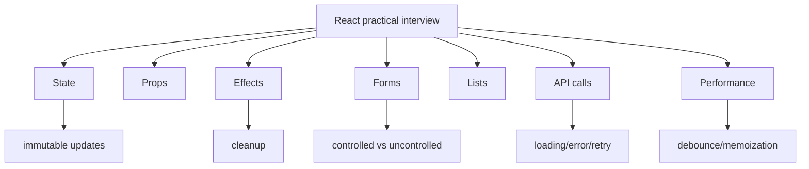

## Practical React topic map



## Controlled vs uncontrolled inputs

| Type | Source of truth | Best for |
|---|---|---|
| Controlled | React state | validation, live UI, disabling submit, predictable forms |
| Uncontrolled | DOM via ref | simple one-off reads, file inputs, quick prototypes |

Controlled input:

```jsx
const [task, setTask] = useState("");

<input
  value={task}
  onChange={(event) => setTask(event.target.value)}
/>
```

Uncontrolled input:

```jsx
const inputRef = useRef(null);

function submit() {
  const value = inputRef.current.value.trim();
}

<input ref={inputRef} />
```

## Immutable array updates

```jsx
setTodos((prev) => [...prev, newTodo]);
setTodos((prev) => prev.filter((todo) => todo.id !== id));
setTodos((prev) =>
  prev.map((todo) =>
    todo.id === id ? { ...todo, task: newTask } : todo
  )
);
```

Why this matters: React detects state changes by reference. Mutating the existing array with `push`, `splice`, or direct assignment can produce stale or invisible UI updates.

## Interview-level debounce explanation

Debounce delays work until the user stops typing. The cleanup function cancels the previous timer.

```jsx
useEffect(() => {
  const timer = setTimeout(() => {
    setDebouncedSearch(search);
  }, 500);

  return () => clearTimeout(timer);
}, [search]);
```

A strong answer says: frontend filtering is fine for small arrays, but backend search with pagination and indexing is required for large datasets.
