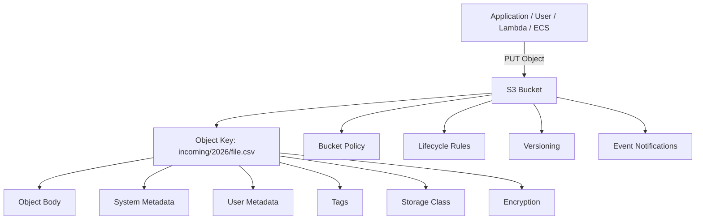
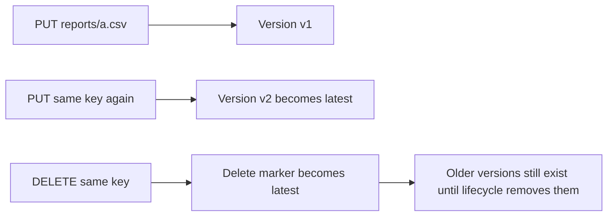
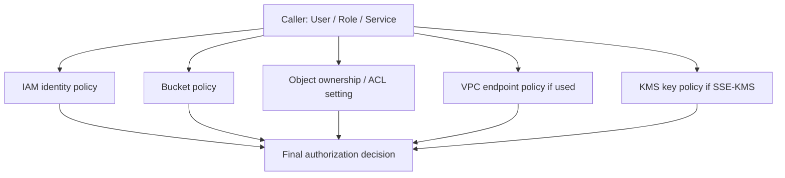
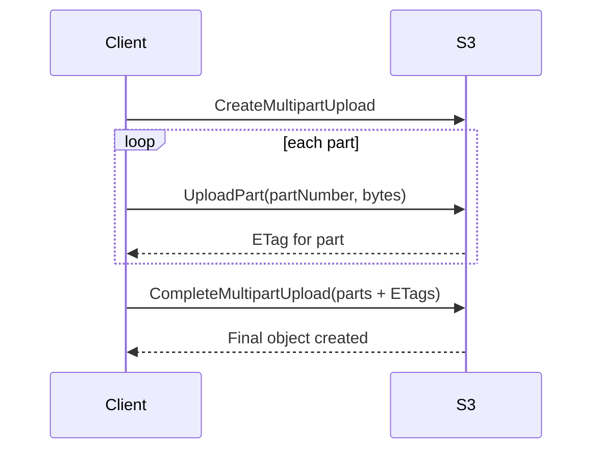
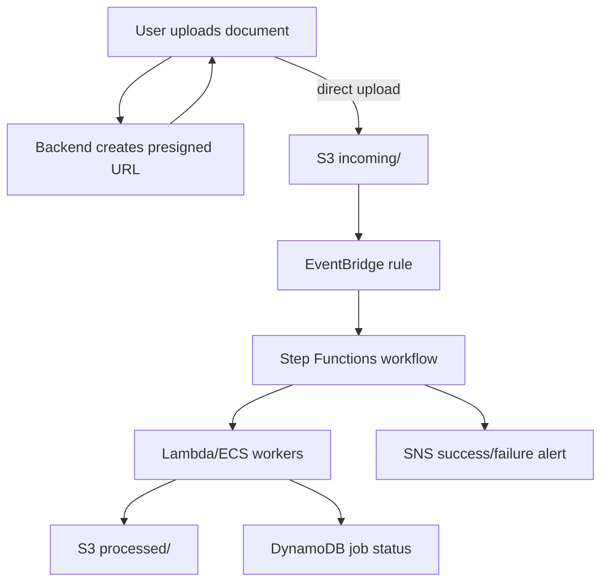

## Definition

**S3 Buckets** are globally named containers for objects in Amazon S3. A bucket is not a folder and S3 is not a normal file system. S3 is **object storage**, which means every uploaded file is stored as an object with a key, metadata, version information, encryption configuration, access controls, tags, storage class, and lifecycle behavior.

A clean interview answer is:

> S3 is durable object storage. I use buckets to store files, logs, backups, reports, images, documents, data lake objects, and processing artifacts. It is not a relational database and it is not block storage. I design S3 around object keys, prefixes, encryption, lifecycle policies, versioning, access policies, event notifications, and cost controls.

## Mental model



Important S3 vocabulary:

| Term | Meaning | Example |
|---|---|---|
| Bucket | Top-level container for objects | `my-company-prod-uploads` |
| Object | The actual stored data plus metadata | A PDF, image, CSV, JSON file |
| Key | Full object path-like identifier | `incoming/users/file.csv` |
| Prefix | Key grouping used for filtering/listing | `incoming/`, `processed/` |
| Metadata | Key-value data attached to object | `Content-Type`, `x-amz-meta-source` |
| Tag | Object-level label useful for lifecycle/cost/security | `project=claims`, `pii=true` |
| ETag | Object identifier/checksum-like value; multipart ETags are not a simple MD5 | Used for conditional processing |
| Version ID | Unique version when versioning is enabled | `3HL4k...` |

## Why S3 exists

S3 exists because applications frequently need a place to store huge amounts of unstructured data without managing disks, file servers, RAID, replication, or capacity planning.

Use S3 when you need:

- durable file/object storage;
- upload/download flows;
- raw input and processed output zones;
- static assets;
- logs and archives;
- data lake landing zones;
- event-driven file processing;
- temporary artifacts for Step Functions, Lambda, Glue, ECS, or Batch;
- lifecycle-based retention and archival.

## When to use S3

Use S3 for:

1. **Large file uploads** such as PDFs, CSVs, Excel sheets, images, and videos.
2. **Data lake storage** where Athena, Glue, EMR, Spark, or Redshift Spectrum reads data.
3. **Event-driven architectures** where uploads trigger EventBridge, Lambda, or Step Functions.
4. **Backup and archive** with lifecycle transition to Glacier classes.
5. **Static website or asset hosting** when paired with CloudFront.
6. **Inter-service handoff** where data is too large for API payloads or Step Functions state.

## When not to use S3

Do not use S3 as:

- a relational database;
- a low-latency mutable record store;
- a queue;
- a POSIX file system for applications that need file locks and partial writes;
- a replacement for EBS/EFS when an application expects mounted block/file storage;
- a transactional system where multiple related writes must commit together.

For structured queries use RDS/PostgreSQL, Aurora, DynamoDB, OpenSearch, Athena, or Redshift depending on access pattern.

## Bucket naming details

Bucket names are globally unique within the S3 namespace. Good production names include organization, application, environment, region, and purpose.

Examples:

```text
acme-claims-prod-ap-south-1-uploads
acme-claims-prod-ap-south-1-processed
acme-claims-dev-ap-south-1-athena-results
```

Avoid:

- random names like `test-bucket-final-new-2`;
- names with personal information;
- names that expose sensitive business context;
- names that you might want to reuse immediately after deletion.

## Object key design

S3 has no real folders. The slash is part of the key. Good key design makes the system searchable, debuggable, and lifecycle-friendly.

Good key structure:

```text
s3://acme-claims-prod-uploads/incoming/year=2026/month=06/day=21/jobId=abc123/source.csv
s3://acme-claims-prod-uploads/jobs/abc123/manifest/manifest.jsonl
s3://acme-claims-prod-uploads/jobs/abc123/partials/part-00001.json
s3://acme-claims-prod-uploads/jobs/abc123/final/output.json
s3://acme-claims-prod-uploads/jobs/abc123/errors/error-00001.json
```

Why this is good:

- easy to list by date, job ID, or stage;
- easy to apply lifecycle policies by prefix;
- easy to debug failed workflows;
- works well with Athena partition-like layouts;
- avoids passing large payloads through Lambda or Step Functions.

## Main S3 storage classes

| Storage class | Best for | Retrieval style | Common use |
|---|---|---|---|
| S3 Standard | Frequently accessed data | Immediate | active uploads, static assets, app files |
| S3 Intelligent-Tiering | Unknown/changing access patterns | Immediate for frequent/infrequent tiers; archive tiers differ | production data with unpredictable access |
| S3 Standard-IA | Infrequently accessed but immediate retrieval | Immediate, retrieval cost applies | monthly reports, old processed data |
| S3 One Zone-IA | Infrequent data that can be recreated | Immediate, single AZ | derived cache-like data |
| S3 Glacier Instant Retrieval | Archive accessed rarely but needs milliseconds retrieval | Immediate | compliance archives with occasional access |
| S3 Glacier Flexible Retrieval | Archive where minutes/hours retrieval is acceptable | Async restore | old backups, low-cost archive |
| S3 Glacier Deep Archive | Long-term archive | Async restore, hours | legal/archive retention |
| S3 Express One Zone | High-performance single-AZ object access | Low latency | specialized high-performance workloads |

Interview nuance: Standard-IA is cheaper for storage but charges for retrieval. Do not move tiny frequently-read files to IA blindly because request and retrieval costs can dominate.

## S3 versioning

Versioning keeps multiple versions of an object when the same key is overwritten or deleted.



Use versioning when:

- accidental overwrite/delete recovery matters;
- auditability matters;
- replication requires it;
- object lock or compliance retention is involved.

Important details:

- deleting an object in a versioned bucket usually creates a **delete marker**;
- old versions still cost money;
- lifecycle rules should clean up noncurrent versions;
- versioning cannot be fully disabled back to the original state; it can be suspended.

## Encryption types

| Type | Description | Best use |
|---|---|---|
| SSE-S3 | S3-managed server-side encryption | simplest default encryption |
| SSE-KMS | KMS-managed encryption keys | audit, key policies, controlled access |
| DSSE-KMS | dual-layer server-side KMS encryption | stricter compliance scenarios |
| SSE-C | customer-provided encryption key per request | rare; operationally complex |
| Client-side encryption | application encrypts before upload | maximum app-side control |

For production, the common answer is: enable default bucket encryption and use SSE-KMS when you need key-level audit/control.

## Access control layers

S3 access is controlled by multiple layers:



Key production advice:

- keep **Block Public Access** on unless you intentionally serve public content through a controlled setup;
- prefer IAM and bucket policies over ACLs;
- use Object Ownership: **Bucket owner enforced** where possible;
- for CloudFront, prefer Origin Access Control rather than public buckets;
- for cross-account writes, design ownership and KMS policy carefully.

## Bucket policy example: allow one Lambda role to read one prefix

```json
{
  "Version": "2012-10-17",
  "Statement": [
    {
      "Sid": "AllowLambdaReadIncomingPrefix",
      "Effect": "Allow",
      "Principal": {
        "AWS": "arn:aws:iam::123456789012:role/claims-prod-worker-role"
      },
      "Action": ["s3:GetObject"],
      "Resource": "arn:aws:s3:::acme-claims-prod-uploads/incoming/*"
    }
  ]
}
```

## IAM policy example: Lambda reads input and writes processed output

```json
{
  "Version": "2012-10-17",
  "Statement": [
    {
      "Effect": "Allow",
      "Action": ["s3:GetObject"],
      "Resource": "arn:aws:s3:::acme-claims-prod-uploads/incoming/*"
    },
    {
      "Effect": "Allow",
      "Action": ["s3:PutObject"],
      "Resource": "arn:aws:s3:::acme-claims-prod-uploads/processed/*"
    },
    {
      "Effect": "Allow",
      "Action": ["s3:ListBucket"],
      "Resource": "arn:aws:s3:::acme-claims-prod-uploads",
      "Condition": {
        "StringLike": {
          "s3:prefix": ["incoming/*", "processed/*"]
        }
      }
    }
  ]
}
```

Minute detail: bucket-level actions like `s3:ListBucket` use `arn:aws:s3:::bucket-name`; object-level actions like `s3:GetObject` use `arn:aws:s3:::bucket-name/*`.

## Lifecycle rules

Lifecycle rules automate storage transitions and deletions.

Example lifecycle design:

```text
incoming/        -> delete failed temporary uploads after 7 days
processed/       -> Standard for 30 days -> Standard-IA for 90 days -> Glacier after 180 days
jobs/*/partials/ -> delete after 14 days
logs/            -> keep 365 days, then Deep Archive or delete
```

Lifecycle is useful for:

- reducing storage cost;
- cleaning temporary files;
- deleting noncurrent versions;
- archiving old reports;
- enforcing retention windows.

Be careful with:

- moving frequently accessed objects to IA too early;
- leaving old versions forever;
- not accounting for minimum storage duration charges;
- lifecycle rules that delete files still needed for audit/debugging.

## Event notification types

S3 can emit events for object creation, object removal, restore events, replication events, lifecycle expiration/transition events, Intelligent-Tiering archival events, object tagging events, and ACL PUT events.

Common object-created event types:

| Event | Meaning |
|---|---|
| `ObjectCreated:Put` | object uploaded using PUT |
| `ObjectCreated:Post` | browser/form POST upload |
| `ObjectCreated:Copy` | object created by copy operation |
| `ObjectCreated:CompleteMultipartUpload` | multipart upload finished |
| `ObjectCreated:*` | any object-created operation |

For production workflows, route through **EventBridge** when you need rich filtering, multiple targets, auditability, retries, or fan-out.

## Multipart upload

Multipart upload breaks a large object into parts, uploads them independently, and completes the object at the end.

Use it for:

- large files;
- unreliable networks;
- faster parallel upload;
- retrying failed parts instead of the whole file.

High-level flow:



For browser uploads, prefer pre-signed URLs so the browser uploads directly to S3 instead of sending huge files through your backend.

## Python boto3 operations

```python
import boto3
from botocore.exceptions import ClientError

s3 = boto3.client("s3")

BUCKET = "acme-claims-prod-uploads"


def upload_report(local_path: str, key: str) -> None:
    s3.upload_file(
        local_path,
        BUCKET,
        key,
        ExtraArgs={
            "ServerSideEncryption": "aws:kms",
            "SSEKMSKeyId": "alias/acme-claims-prod-s3",
            "ContentType": "text/csv",
            "Tagging": "project=claims&stage=incoming",
        },
    )


def read_object_text(key: str) -> str:
    try:
        response = s3.get_object(Bucket=BUCKET, Key=key)
        return response["Body"].read().decode("utf-8")
    except ClientError as exc:
        code = exc.response.get("Error", {}).get("Code")
        if code == "NoSuchKey":
            raise FileNotFoundError(key) from exc
        raise


def create_presigned_put_url(key: str, content_type: str) -> str:
    return s3.generate_presigned_url(
        ClientMethod="put_object",
        Params={
            "Bucket": BUCKET,
            "Key": key,
            "ContentType": content_type,
        },
        ExpiresIn=900,
    )
```

## Console setup steps

1. Open **S3** in AWS Console.
2. Choose **Create bucket**.
3. Enter a globally unique bucket name.
4. Select the AWS Region.
5. Keep **Block all public access** enabled unless there is a very specific public-serving reason.
6. Enable **Bucket Versioning** if recovery/audit matters.
7. Enable **Default encryption**: SSE-S3 for simple cases or SSE-KMS for controlled key usage.
8. Create the bucket.
9. Open **Properties** and configure lifecycle rules if needed.
10. Open **Permissions** and verify Block Public Access, bucket policy, Object Ownership, and CORS.
11. Open **Management** and configure metrics, inventory, replication, or lifecycle depending on the workload.
12. Open **Properties → Event notifications** if the bucket should trigger workflows.

## Real-world architecture: upload and process documents



## Common mistakes

1. Treating S3 like a local folder system.
2. Passing large S3 objects through Lambda or Step Functions payloads instead of passing bucket/key metadata.
3. Forgetting that old object versions cost money.
4. Using public bucket access when CloudFront + OAC would be safer.
5. Not scoping IAM to prefixes.
6. Forgetting KMS permissions when bucket uses SSE-KMS.
7. Applying lifecycle transitions without understanding retrieval costs.
8. Not designing idempotency for S3 events.
9. Using object keys with spaces/special characters without proper URL encoding/decoding.
10. Not cleaning incomplete multipart uploads.

## Production best practices

- Use separate buckets or prefixes for incoming, processed, quarantine, and failed files.
- Keep Block Public Access enabled by default.
- Enable default encryption.
- Use KMS where audit and key control matter.
- Use lifecycle policies for temporary files and noncurrent versions.
- Use bucket policies and IAM least privilege.
- Use S3 Inventory for large-scale object reporting.
- Use CloudTrail data events only where needed because they can be noisy/costly.
- Use EventBridge for serious event routing.
- Use object tags for lifecycle, cost allocation, and processing metadata.
- Use pre-signed URLs for direct browser upload/download.
- Use VPC endpoints for private access from workloads in VPC.
- Store workflow state in DynamoDB/RDS rather than relying only on event delivery.

## Interview-style explanation

> An S3 bucket stores objects by key. I design buckets around prefixes, encryption, versioning, lifecycle, event notifications, and least-privilege access. For file processing, I do not pass file bytes through the workflow; I pass bucket/key/version metadata. I enable EventBridge or S3 notifications, make processors idempotent, store job status in DynamoDB or RDS, and write final outputs back to predictable prefixes. For cost, I use lifecycle rules and storage classes carefully, especially for noncurrent versions and temporary artifacts.
