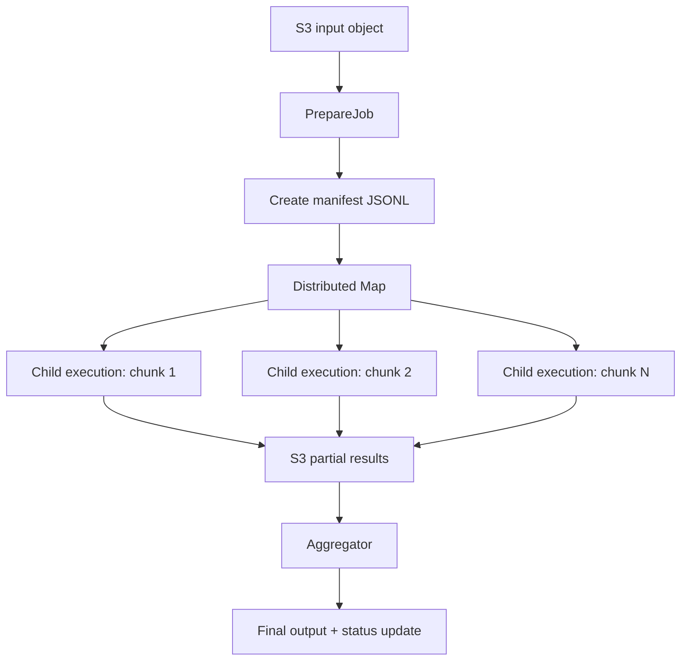

## State machine types and state types

Step Functions has two workflow types:

| Type | Best for | Notes |
|---|---|---|
| Standard | durable, auditable, long-running workflows | best for large file orchestration and reliable business processes |
| Express | very high volume short workflows | lower cost for high-throughput short tasks, different execution semantics |

Important state types:

| State | Purpose |
|---|---|
| Task | call Lambda, ECS, Glue, DynamoDB, SNS, SQS, API Gateway, etc. |
| Choice | conditional branching |
| Map | repeat over items |
| Distributed Map | large-scale parallel fan-out with child executions |
| Parallel | run branches concurrently |
| Wait | delay workflow |
| Pass | transform/pass data |
| Succeed / Fail | terminal success/failure states |

## Why payload discipline matters

Do not push large files or huge arrays through Step Functions state. Use S3 for data and pass metadata.

```json
{
  "jobId": "job-123",
  "bucket": "acme-data-prod",
  "key": "input/large-file.csv",
  "manifestKey": "jobs/job-123/manifest/manifest.jsonl",
  "outputPrefix": "jobs/job-123/partials/"
}
```

This keeps the state small and avoids hitting payload/history limits. The workflow orchestrates; S3 stores; workers compute.

## Distributed Map flow



## Worker choice: Lambda vs ECS/Fargate vs Glue

| Worker | Use when | Avoid when |
|---|---|---|
| Lambda | short chunk processing, simple transforms, low ops | runtime/temp storage is insufficient |
| ECS/Fargate | heavier CPU/memory, custom containers, longer processing | job is tiny and Lambda is simpler |
| Glue/Spark | tabular/big-data transformations | low-latency request-response work |
| Batch | large queued compute workloads | simple event handler is enough |

## ResultWriter and manifest pattern

For large fan-out, do not collect every child result back into parent state. Use ResultWriter to write child results to S3, then aggregate from S3.

```json
{
  "Type": "Map",
  "ItemReader": {
    "Resource": "arn:aws:states:::s3:getObject",
    "ReaderConfig": {
      "InputType": "JSONL"
    },
    "Parameters": {
      "Bucket.$": "$.manifestBucket",
      "Key.$": "$.manifestKey"
    }
  },
  "ItemProcessor": {
    "ProcessorConfig": {
      "Mode": "DISTRIBUTED",
      "ExecutionType": "STANDARD"
    },
    "StartAt": "ProcessChunk",
    "States": {
      "ProcessChunk": {
        "Type": "Task",
        "Resource": "arn:aws:states:::lambda:invoke",
        "OutputPath": "$.Payload",
        "Parameters": {
          "FunctionName": "process-large-file-chunk",
          "Payload.$": "$"
        },
        "End": true
      }
    }
  },
  "ResultWriter": {
    "Resource": "arn:aws:states:::s3:putObject",
    "Parameters": {
      "Bucket.$": "$.resultBucket",
      "Prefix.$": "$.resultPrefix"
    }
  },
  "End": true
}
```

## IAM permissions for this pattern

The Step Functions execution role usually needs tightly scoped permissions for:

- invoking specific Lambda functions;
- starting child executions for Distributed Map;
- reading the input/manifest S3 prefixes;
- writing result prefixes;
- updating DynamoDB job status;
- publishing SNS alerts;
- decrypting KMS keys if S3 or Lambda env vars use KMS.

Production answer: start broad during prototype only if necessary, then scope resources to exact ARNs and prefixes before release.
